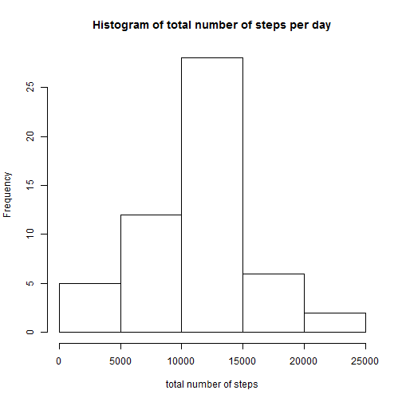
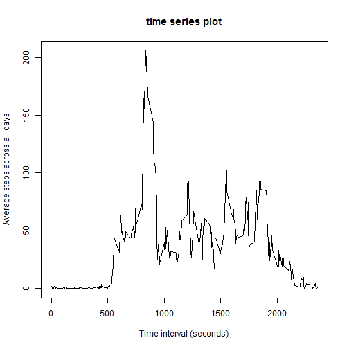
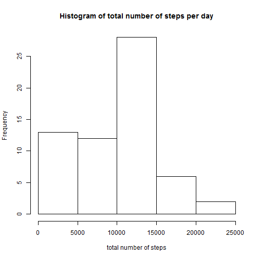
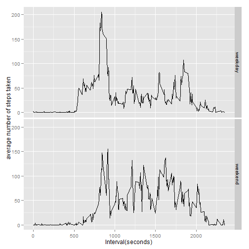

## Loading and preprocessing the data


```r
# load data
data<- read.csv('activity.csv', header = TRUE)
# subset rows without NA
ok<- complete.cases(data$steps)
dataComplete<- data[ok,]
```

## What is mean total number of steps taken per day?
histogram of total number of steps taken each day

```r
# find total number of steps for each day
total<- aggregate(dataComplete$steps, by = list(dataComplete$date), FUN = sum)
# histogram the total values
hist(total$x, xlab = 'total number of steps', ylab = 'Frequency', main = paste("Histogram of total number of steps per day"))
```

 

```r
meanSteps<- mean(total$x)
medianSteps<- median(total$x)
```

**The mean of total steps taken per day is 1.0766189 &times; 10<sup>4</sup> and the median is 10765**

## What is the average daily activity pattern?

```r
# Average steps taken per interval, averaged across all days.
avgSteps<- aggregate(dataComplete$steps, by = list(dataComplete$interval), FUN = mean)

names(avgSteps)<- c('interval', 'meanSteps')

plot(avgSteps$interval, avgSteps$meanSteps, type = 'l', xlab = 'Time interval (seconds)', ylab = 'Average steps across all days')
title('time series plot')
```

 

```r
max_step<- which.max(avgSteps$meanSteps)
max_interval<- avgSteps$interval[max_step]
```

On average across all the days, the interval 835 to 840 seconds, has the maximum number of steps.


## Imputing missing values

*1. Total number of rows with NAs is **2304** *

*2. Filling missing values in the dataset *

Here, I choose to replace the missing values in each row, with the mean for that 5 minute interval averaged over all dates. 


```r
# Extract mean values - averaged over intervals
meanSteps<- aggregate(data$steps, by=list(data$interval), FUN = median, na.rm = TRUE)

names(meanSteps)<- c('interval', 'steps')

intervals<- unique(data$interval)
steps<- data$steps
x<- 1:length(intervals)

# For each 'NA' step in a given date, replace with average for that interval

for (i in x){  
  k<- intervals[i]
  s<- which(data$interval==k) #indices for current interval
  d<- which(!complete.cases(data$steps[s])) #indices where steps for this interval is NA
  
  steps[s[d]]<- meanSteps$steps[i]
}
```

*3. Create new dataset with missing values filled *


```r
data_new<- data
data_new$steps<- steps
```

*4. Histogram of total number of steps taken each day *


```r
# find total number of steps for each day
totalnew<- aggregate(data_new$steps, by = list(data_new$date), FUN = sum)
# histogram the total values
hist(totalnew$x, xlab = 'total number of steps', ylab = 'Frequency', main = paste("Histogram of total number of steps per day"))
```

 

```r
# mean and median
mean_new<- mean(totalnew$x)
median_new<- median(totalnew$x)
```

**The mean of total steps taken per day is 9503.8688525 and the median is 10395. Yes, these values differ from that of the first values. The effect of imputing seems to lower the mean and median values.**


## Are there differences in activity patterns between weekdays and weekends?

*1. Create new factor variable with two levels - "weekday and weekend" *


```r
#convert date column to Date class

data_new$date<- as.Date(data_new$date, "%Y-%m-%d")
days<- weekdays(data_new$date)

days[days=="Sunday"]<- "weekend"
days[days=="Saturday"]<- "weekend"
days[days!= "weekend"]<- "weekday"

#Add new column to existing dataframe
data_new["days"]<- factor(days)
```

*2. Time Series Plots *


```r
#weekday data
week<- aggregate(data_new$steps, by = list(data_new$interval, data_new$days), FUN = mean) 

library(ggplot2)
sp<- ggplot(week, aes(x=Group.1, y = week$x))+geom_line() +facet_grid(Group.2 ~ .)

sp<- sp+xlab('Interval(seconds)') + ylab('average number of steps taken')

sp
```

 

